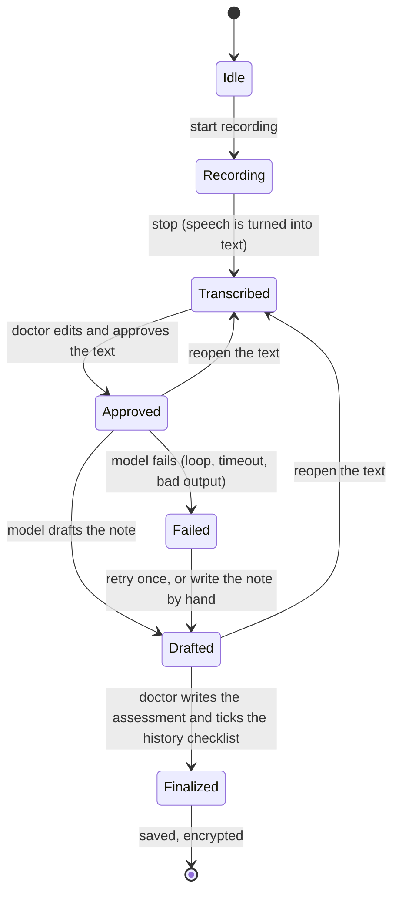
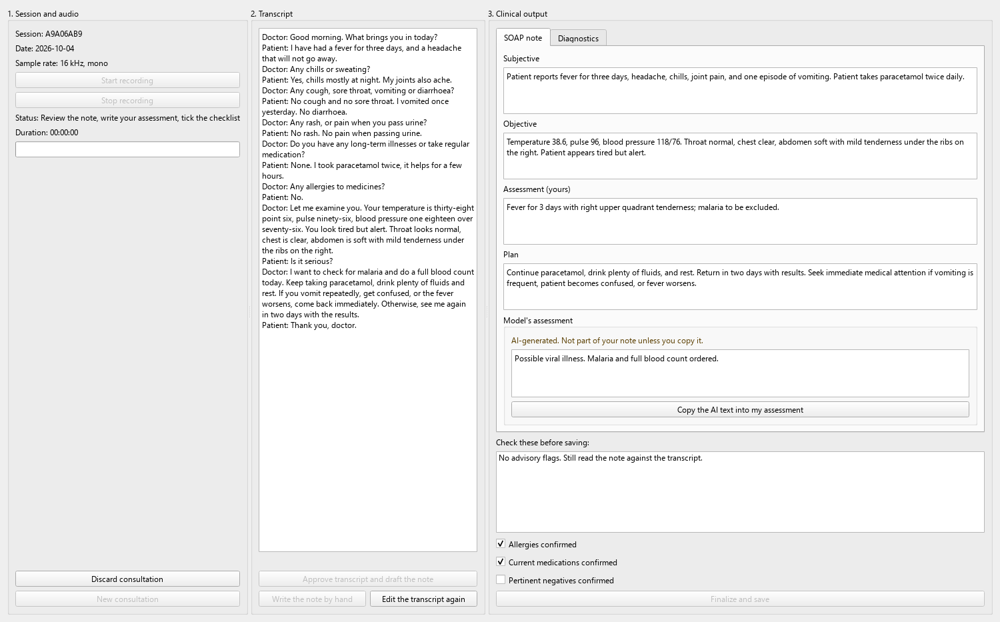
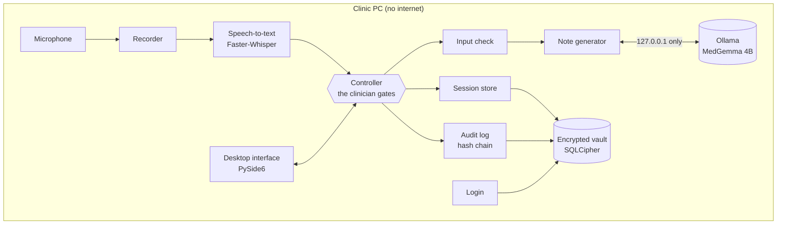

# Offline Clinical Consultation Assistant

A Windows desktop application that listens to a doctor–patient consultation, turns the speech into
text, and drafts a clinical note from it, **without an internet connection**. The speech
recognition (Faster-Whisper) and the language model (MedGemma 4B, quantized) both run on the
clinic's own computer. The doctor reviews and corrects everything before it is saved, and saved
records are encrypted on disk.

Final-year project, Bachelor of Business Information Technology, Strathmore University (2026).
Author: Mark Kinuthia.

> **Not a medical device.** The application produces drafts for a qualified clinician to check.
> It has not been clinically validated. All development and testing use made-up (synthetic)
> consultations. No real patient data is, or should ever be, in this repository.

---

## Contents

1. [The project in plain language](#1-the-project-in-plain-language)
2. [Why it exists](#2-why-it-exists)
3. [What happens during a consultation](#3-what-happens-during-a-consultation)
4. [How it is built](#4-how-it-is-built)
5. [Rules the code follows](#5-rules-the-code-follows)
6. [What is built so far](#6-what-is-built-so-far)
7. [What has been measured](#7-what-has-been-measured)
8. [Known limits](#8-known-limits)
9. [Running it](#9-running-it)
10. [A tour of the code](#10-a-tour-of-the-code)
11. [How the work is organised](#11-how-the-work-is-organised)
12. [Documents in this repository](#12-documents-in-this-repository)
13. [Glossary](#13-glossary)

---

## 1. The project in plain language

Doctors in busy clinics spend a lot of time writing notes. Tools that write notes automatically
usually send the conversation to a company's servers over the internet. That is a problem when the
internet is slow or missing, and a bigger problem when the conversation is private medical
information.

This project does the same job on the clinic's own computer:

1. **It records** the consultation through the computer's microphone.
2. **It writes down** what was said (speech-to-text), on the computer itself.
3. **The doctor reads and corrects** that text. Nothing goes further until the doctor approves it.
4. **It drafts a note** in the standard SOAP layout (Subjective, Objective, Assessment, Plan), using
   a medical language model that also runs on the computer itself.
5. **The doctor checks the note**, writes their own assessment, and confirms that allergies,
   medicines and important negatives were covered.
6. **It saves** the finished record in an encrypted file that is unreadable without the password.

The computer never needs the internet, and nothing about the patient leaves it. The software
helps the doctor write; it does not decide anything for them.

---

## 2. Why it exists

- **Connectivity.** Many clinics have unreliable or expensive internet. Cloud tools stop working
  when the connection does.
- **Privacy.** Sending consultations to an outside server creates risk and obligations under the
  Kenya Data Protection Act 2019. Keeping everything on one machine reduces that risk. It does not
  by itself make a clinic compliant; the clinic still has duties (consent, access control, retention).
- **Hardware.** Clinic computers are modest. The reference machine for this project is an ordinary
  laptop: AMD Ryzen 5 5625U, 8 GB of RAM, no graphics card used. Everything is measured on it.

---

## 3. What happens during a consultation

The application is a step-by-step process. The software will not let a step happen early.



What each gate is there for:

| Gate | What the software checks | Why |
|---|---|---|
| Approve the transcript | the doctor has looked at and approved the text | the model only ever sees text a person has checked |
| Generate the draft | the text passes the input check; the model has at most two tries | speech-to-text mistakes and odd input should not reach the model unchecked; the model cannot run forever |
| Finalize | the doctor has written their own assessment; allergies, medicines and pertinent negatives are ticked | in testing, the model sometimes stated diagnoses the doctor never made, and every note checked by hand left out allergies or negatives |
| Save | the database itself refuses a record without those ticks or without an assessment | a bug elsewhere in the code still cannot store an unconfirmed note |

If the model fails, the transcript is kept and the doctor can retry or write the note by hand.
Nothing typed is lost.

---

### The consultation screen



Left to right: the recording controls, the transcript the clinician corrects and approves, and the
drafted note. The clinician's own assessment is separate from the model's text, which is labelled
as AI-generated. "Finalize and save" stays disabled until the assessment is written and all three
history boxes are ticked; here one is still unticked.

---

## 4. How it is built



The design is "ports and adapters". The **controller** in the middle holds the rules and knows
nothing about microphones, models or databases. Each outside piece (recorder, speech-to-text,
model, storage) plugs in through a small interface (a "port"). That has two benefits:

- **Testing.** Every rule can be tested with stand-in parts, in seconds, without a microphone or a
  model. The real parts have their own tests.
- **Swapping.** A different model or speech engine can be plugged in without touching the rules.

Choices made, and why (full reasoning in [`docs/ADR/`](docs/ADR/)):

| Part | Choice | Reason |
|---|---|---|
| Language model | MedGemma 4B, quantized to Q4_K_M, run by Ollama | medical model that fits on an 8 GB PC; a "2B" MedGemma does not exist (ADR-002) |
| Speech-to-text | Faster-Whisper, on the CPU | accurate, runs offline, works without a graphics card |
| Storage | SQLite with SQLCipher (AES-256), keys from Argon2id | whole-file encryption that installs on Windows without extra tools (ADR-001, ADR-003) |
| Interface | PySide6 desktop app (official Qt for Python) | one screen, no web server needed; its LGPL licence suits handing the installer to clinics |
| Packaging | a normal Windows installer | Docker adds overhead and cannot easily reach the microphone on clinic PCs |
| Network | none; the only connection is to Ollama on the same PC (127.0.0.1) | the air gap is a core requirement |

There is no web server (such as FastAPI) in the application. A server would open a network port
for no benefit, since the interface and the logic run in the same program.

---

## 5. Rules the code follows

These apply to every file, and the tests check them.

1. **Air-gapped.** The application makes no outbound network connections, and this is enforced,
   not just promised: a guard inside the app refuses any connection, listening port or address
   lookup that leaves the computer, and Windows Firewall rules block the app and Ollama from
   sending anything out. The only connection is to Ollama on 127.0.0.1; the client ignores proxy
   settings so a proxy can never sit in between. The window's header shows what the network check
   actually found, never a fixed "Air-Gapped" label.
2. **The clinician is in charge.** The model only sees text the clinician approved. A note becomes
   final only after the clinician writes their own assessment and confirms the required history.
   The model's suggestions are kept apart from the clinician's words and labelled as AI output.
3. **No patient information in logs or error messages.** Errors are short codes such as
   `incorrect_passphrase` or `history_not_confirmed`, never sentences that could quote a patient.
   The audit log accepts only event names and ids.
4. **Honest claims.** No claim about speed, accuracy or compliance without a measurement behind it.
   Limits are written down next to results.
5. **Safety rules are tested by breaking them.** For each safety rule, the rule was switched off on
   purpose and a test was confirmed to fail. If no test fails, the test is not good enough.
6. **Windows first.** Every database connection and file is closed explicitly, because Windows
   cannot delete a file that is still open.

---

## 6. What is built so far

Status is kept up to date in [`docs/traceability.md`](docs/traceability.md). A requirement counts
as **verified** only when its tests pass on Windows in GitHub Actions and any measurement it needs
is recorded.

| Part | Requirement | State |
|---|---|---|
| Controller with the clinician gates | FR-11 to FR-15 | built and tested |
| Note generator (Ollama client, output cap, loop detection, retry, JSON check, advisory flags) | FR-04, FR-05, FR-13 | built and tested on real model output |
| Encrypted vault, recovery code, session store, optional encrypted audio | FR-07, NFR-05 | built; Windows CI green |
| Accounts, roles, lockout, idle timeout | FR-08, FR-10a | built and tested |
| Tamper-evident audit log | FR-09, FR-10d | built and tested |
| Input check (prompt injection, personal data) and checks on the model's reply | FR-05, AMD-11 | built and tested |
| Microphone recorder | FR-01 | built and tested, including on the real microphone |
| Speech-to-text (Faster-Whisper small, offline) | FR-02 | built and measured with synthetic speech |
| Desktop interface (PySide6): consultation screen, records, audit and accounts | FR-03, FR-06, FR-16 | built and tested |
| Wiring of all parts, memory plan, startup checks | NFR-04, NFR-07 | built and run end to end |
| Air-gap enforcement: in-app network guard, firewall rules, checks shown on screen | NFR-01, NFR-02, FR-18 | built; firewall rules to be applied on the reference PC |
| Evaluation: 8 scripted consultations with key facts and traps, scored end to end | FR-05, NFR-03, NFR-06 | built and run; clinician scoring pending |
| Windows installer and offline model bundle, with a self-test | release, AMD-15 | built; test on a second PC pending |

More than 350 tests run on every push, on Windows with Python 3.11 and 3.12, together with
lint and format checks.

---

## 7. What has been measured

All on the reference PC (Ryzen 5 5625U, 8 GB RAM, Windows, CPU only), with synthetic consultations.
These numbers describe one machine; they are not promises for every PC.

**Language model** ([ADR-002](docs/ADR/002-llm-runtime-and-model.md),
[full table](docs/spikes/llm-results.md))

| What | Result |
|---|---|
| Model size | 3.11 GB on disk, 2.68 GB in memory |
| Writing speed | 5.8 to 7.3 tokens per second (roughly 4 to 5 words per second) |
| Short consultation, note ready | about 25 to 30 s once loaded; 37 to 58 s from cold |
| Long consultation (1,472 words), note ready | about 2.6 to 3.2 minutes |
| Valid note format, short consultation | 22 of 22 runs |
| Long consultations without a repetition penalty | looped in 9 of 9 runs; with penalty 1.1, 4 of 4 finished |

Because of that last result, long transcripts start with the repetition penalty, and the
generator watches for repeated sentences and stops early instead of waiting for the token limit.

**Storage and login** ([ADR-003](docs/ADR/003-key-management-and-audio.md),
[ADR-004](docs/ADR/004-authentication-and-audit.md),
[results file](docs/spikes/vault-timing-mark-pc.json))

| What | Result |
|---|---|
| Unlock the vault | 0.17 s |
| Wrong passphrase | 0.17 s (same as a right one, so timing gives nothing away) |
| Log in | 0.18 s; unknown username also 0.18 s |
| Save one consultation | 0.01 s |
| SQLCipher on Windows: wrong key rejected, no readable text in the file, one flipped bit detected | all pass (ADR-001) |

**Input check** ([ADR-005](docs/ADR/005-input-guard.md),
[results file](docs/spikes/guard-mark-pc.json))

| What | Result |
|---|---|
| Ordinary consultation sentences held back by mistake | 0 of 48 |
| Attacks with a clear sign of talking to the AI, caught | 22 of 22 |
| Including 4 reworded attacks it is not designed to catch | 22 of 26 |
| Time to check a 1,486-word consultation | 5 ms |

These sentences were written by the same person who wrote the rules, so the rates are a best case.

**Microphone** ([ADR-006](docs/ADR/006-audio-recorder.md),
[results file](docs/spikes/mic-mark-pc.json))

| What | Result |
|---|---|
| Records at 16 kHz mono directly (what Whisper needs) | yes |
| Time to start recording | 0.13 s |
| 60-second recording | 59.9 s captured, no audio lost |

**Speech-to-text** ([ADR-007](docs/ADR/007-speech-to-text.md),
[results file](docs/spikes/asr-mark-pc.json)), on the synthetic consultations read aloud by the
Windows computer voices, which is a best case:

| What | base model | small model (default) |
|---|---|---|
| Words wrong, after spelling and unit differences are set aside | 1.6 to 1.7% | 0.7 to 1.6% |
| Medicine names heard correctly | 6 of 11 | 9 of 11 |
| Time for an 11-minute consultation | 40 s | 1.8 minutes |
| Peak memory | 0.85 GB | 0.97 GB |

Whisper writes one block of text without saying who spoke; the clinician can add labels while
reviewing (AMD-37).

**The whole chain** ([ADR-008](docs/ADR/008-composition-and-startup.md),
[results file](docs/spikes/pipeline-mark-pc.json)): speech in, Whisper, input check, MedGemma,
encrypted save, with the speech model and the language model never in memory together.

| What | Short consultation (1 min 44 s) | Long consultation (10 min 51 s) |
|---|---|---|
| Wait from end of consultation to draft note | 70 s | 4.9 minutes |
| of which speech-to-text | 21 s | 126 s |
| of which drafting the note | 49 s | 165 s |

The PC had only 0.55 to 1.4 GB free at the start because other programs were open; with more
free memory the drafting step is faster (ADR-002).

**How good are the notes?** ([ADR-011](docs/ADR/011-evaluation.md),
[report](docs/eval/report-mark-pc-speech.md)) Eight synthetic Kenyan primary-care consultations
(168 key facts, 70 of them critical), each read aloud, transcribed by Whisper and drafted by
MedGemma, then scored:

| What | From speech | From the written script |
|---|---|---|
| Key facts in the note | 89.9% | 92.3% |
| Critical facts (allergies, doses, readings, orders, warnings) | 90.0% | 97.1% |
| Symptoms the patient denied, written as present | 0 | 0 |
| Traps (a relative's illness, a drug the doctor ruled out, a diagnosis nobody made) | 0 | 0 |
| Notes needing the second attempt | 1 of 8 | 1 of 8 |

The biggest weakness: when Whisper mishears a medicine ("Glendamycin" for clindamycin, "sulfur" for
sulfa), the note repeats the mistake. The clinician's transcript check is what catches it.

**What the notes got wrong** (7 notes read by hand against their transcripts). Plan items were
accurate. But every note left out allergies or pertinent negatives; 3 of 4 short notes stated a
diagnosis the doctor had not made; one long note changed a blood-pressure reading, contradicted a
symptom the patient described, and invented "the patient's wife is present". These findings are why
the clinician gates exist. The automatic flags caught some of these errors (a mismatched number, a
merged word, a pronoun) but not most, which is why a proper evaluation with scripted consultations
is still to come.

---

## 8. Known limits

- **One machine.** Every measurement comes from one laptop, usually with only 0.7 to 3.6 GB of free
  memory because other programs were open.
- **Not validated with clinicians yet.** Note quality has been checked by reading a handful of notes,
  not by a structured evaluation or by practising clinicians.
- **English only so far.** Swahili and mixed Swahili-English speech are untested.
- **The flags are hints.** Advisory flags (numbers that do not match the transcript, merged words,
  pronouns) are simple checks, not a measure of whether a note is faithful.
- **Encryption protects files, not a running session.** While the app is unlocked, keys and open
  records are in the computer's memory. Anyone who copies the vault files can try to guess the
  passphrase offline, so a strong passphrase matters (at least 12 characters, enforced).
- **The audit log needs an outside copy to be fully trustworthy.** Editing or removing entries in
  the middle is detected. Removing the newest entries is only detectable if the latest chain value
  was written down somewhere else.
- **Ollama listens on a local port.** It accepts connections from the same PC only, but it is a
  second program that has to be trusted.

---

## 9. Running it

**Installing on a clinic PC** (no internet needed): copy `ClinAssist-Setup.exe` and the `bundle`
folder together, run the installer, accept Windows' permission prompt and the model licence.
It checks every bundled file first, installs the program and the models, installs Ollama if
needed, and turns on the firewall rules. To confirm it works:

```powershell
& "C:\Program Files\ClinAssist\ClinAssist-check.exe" --self-test
```

**Building the installer** (development PC; needs PyInstaller and Inno Setup 6):

```powershell
powershell -ExecutionPolicy Bypass -File release\build_release.ps1
```

It runs the tests, packages the program, builds and checks the bundle, self-tests the built
program and compiles the installer, stopping at the first failure. Output: `build\`.

**From source:**

**Start the application** (needs the speech model in `models/` and Ollama running):

```powershell
python -m clinassist.ui
```

On first run it checks the PC, asks for a vault passphrase, shows the recovery code once, and
asks for the first administrator account.

**Setup** (Windows, PowerShell, Python 3.11):

```powershell
py -3.11 -m venv .venv
.\.venv\Scripts\Activate.ps1
python -m pip install --upgrade pip
pip install -e ".[dev,storage,audio,asr,ui]"
pre-commit install
```

**Run the tests and checks:**

```powershell
pytest
ruff check . ; ruff format --check .
```

**Block network access with Windows Firewall.** In a clinic this is done by the installer, and the
readiness screen has a "Turn on offline protection" button if the rules ever go missing. When
running from source, do it once in PowerShell opened as administrator (use `-Remove` before
installing packages, then `-Apply` again):

```powershell
powershell -ExecutionPolicy Bypass -File scriptsirgap_firewall.ps1 -Apply
```

**Check this PC is ready** (models, Ollama, free memory, microphone, network):

```powershell
python -m clinassist.startup
```

**Try the note generator** on a synthetic transcript. This needs [Ollama](https://ollama.com)
installed and the model pulled once (`ollama pull medgemma:4b`); after that it works offline.

```powershell
python scripts/try_note.py spikes/transcripts/synthetic_consult_01.txt
python scripts/try_note.py spikes/transcripts/synthetic_consult_long.txt --attempt 2
```

**Run the evaluation** (8 scripted consultations through the whole system; about 15 minutes):

```powershell
python eval/run_eval.py --label my-pc                 # from speech, through Whisper
python eval/run_eval.py --label my-pc --source script # the labelled script straight in
```

Results, a readable report and a clinician scoring sheet are written to `docs/eval/`.

**Repeat the measurements** on another machine:

```powershell
python scripts/check_microphone.py               # live level meter; speak and watch the bar
python spikes/storage_spike.py --label my-pc     # SQLCipher, Argon2id, AES-GCM checks
python spikes/vault_timing.py --label my-pc      # unlock, login and save times
python spikes/mic_spike.py --label my-pc         # microphone capture checks
python spikes/asr_spike.py --label my-pc         # speech-to-text accuracy, speed, memory
python spikes/llm_spike.py --help                # model speed and memory (needs Ollama)
```

Results are written to `docs/spikes/` with the machine label in the file name.

---

## 10. A tour of the code

```
src/clinassist/
  metrics.py         word error rate and medicine-name recall, for measuring speech-to-text
  model_files.py     the published fingerprint of each model file, and a check against it
  airgap.py          the network guard and the passive network checks
  app.py             builds the real parts and connects them; keeps the two models apart in memory
  config.py          the settings file, with the reason for each default
  startup.py         checks this PC is ready: models, Ollama, memory, microphone, data folder
  ui/                the desktop screens: consultation workspace, records, audit and accounts, dialogs
  evaluation.py      scores a note against a consultation's key facts, denied symptoms and traps
  bundle.py          builds and checks the offline model bundle shipped beside the installer
  selftest.py        uses every heavy part once, to prove an installed copy works
  domain.py          the data the app works with (draft, note, checklist, session record) and its errors
  ports.py           the small interfaces each outside part must provide
  controller.py      the consultation steps and the clinician gates (the heart of the app)
  adapters/
    ollama_client.py   talks to Ollama on 127.0.0.1 only, streaming the reply, ignoring proxies
    soap_generator.py  builds the prompt, caps and watches the output, checks the JSON, sets flags
    loopcheck.py       spots the model repeating itself
    groundcheck.py     advisory flags: pronouns, numbers not in the transcript, merged words
    input_guard.py     holds back text aimed at the AI; hides phone numbers, emails and ID numbers
    recorder.py        records the microphone at 16 kHz into memory; reports silence and errors
    transcriber.py     Faster-Whisper speech-to-text, loaded from a local folder only
    numbers.py         reads numbers written as digits or words, for the number check
    store.py           saves a finished consultation into the vault in one transaction
    audio_store.py     optional encrypted audio files (off by default)
  security/
    crypto.py          key handling: Argon2id, key wrapping, separate keys per purpose
    vault.py           the encrypted database, passphrase, recovery code, passphrase rules
    schema.py          the database tables and their upgrade steps
    auth.py            accounts, roles, lockout after 5 wrong passwords, 10-minute idle timeout
    audit.py           the audit log, where each entry seals the one before it
tests/               one test file per module, plus fakes for Ollama and the hardware
spikes/              measurement scripts; results go to docs/spikes/
scripts/             small tools for trying parts by hand
docs/                decisions, amendments, requirement status, measurements
```

Three places worth reading first:

- **`controller.py`** shows every step of a consultation and every gate in about 200 lines.
- **`security/vault.py`** shows how the passphrase, the recovery code and the encrypted database
  fit together.
- **`tests/test_store.py`**, test `test_database_rejects_records_the_controller_would_never_produce`,
  shows the database refusing an unconfirmed note even when the controller is bypassed.

---

## 11. How the work is organised

The history of this repository is meant to show how the system was built, one piece at a time.

- **One branch per module.** Branch names say what kind of work it is: `spike/` (an experiment to
  measure something), `feature/` (a part of the app), `docs/`, `eval/`, `release/`, `chore/`.
- **Pull requests into `main`.** Each one lists the requirements it covers, the tests that prove
  it, any measurement, and a safety checklist. They are merged with a merge commit, never squashed,
  so each module's commits stay visible.
- **Small commits** with messages in the form `type(scope): summary`, for example
  `feat(auth): add accounts, roles, lockout and idle timeout`.
- **Decisions are written down** as Architecture Decision Records in `docs/ADR/`, each with the
  options considered, the evidence and the limits.
- **Changes to the approved proposal** are logged in `docs/AMENDMENTS.md` as they happen, and the
  proposal document is updated once, at the end, from that log.
- **Every push is tested on Windows** (Python 3.11 and 3.12) by GitHub Actions, with lint and format
  checks.

Method: the proposal uses the V-model. Here it is applied once per module: requirement, design,
code, then the tests and measurements that check that requirement, before moving on.

---

## 12. Documents in this repository

| Document | What it is |
|---|---|
| [`docs/traceability.md`](docs/traceability.md) | every requirement, the branch that builds it, the test that checks it, and its status |
| [`docs/AMENDMENTS.md`](docs/AMENDMENTS.md) | every change from the approved proposal, with the reason |
| [`docs/proposal/CROSSCHECK.md`](docs/proposal/CROSSCHECK.md) | how the code maps onto the proposal's use cases, diagrams, schema and wireframe |
| [`docs/ADR/`](docs/ADR/) | decisions: storage (001), model and runtime (002), keys and audio (003), login and audit (004), input guard (005), microphone (006), speech-to-text (007), wiring and startup checks (008), desktop interface (009), air gap (010), evaluation (011), installer (012) |
| [`docs/spikes/`](docs/spikes/) | raw measurement results from the reference PC |
| [`docs/PRIOR_ART.md`](docs/PRIOR_ART.md) | what was reused from the earlier MedgemmaV2 prototype and what was left out |

---

## 13. Glossary

| Term | Meaning |
|---|---|
| **SOAP note** | the standard layout for a clinical note: Subjective (what the patient says), Objective (what is measured or examined), Assessment (the clinician's conclusion), Plan (what happens next) |
| **Air-gapped** | not connected to any outside network |
| **Speech-to-text (ASR)** | software that turns recorded speech into written text; here Faster-Whisper |
| **Language model (LLM)** | software that writes text; here MedGemma 4B, a model trained further on medical text |
| **Quantized** | stored with smaller numbers so the model fits in less memory, at a small cost in accuracy |
| **Ollama** | a program that runs language models on your own computer |
| **Token** | a piece of a word; the model writes one token at a time |
| **Repetition penalty** | a setting that discourages the model from repeating itself |
| **SQLCipher** | a version of the SQLite database that encrypts the whole file |
| **Argon2id** | a deliberately slow way to turn a password into a key, so guessing is expensive |
| **Envelope key** | the data is locked with a random key, and that key is itself locked by the passphrase and, separately, by a recovery code; changing the passphrase only re-locks the small key |
| **Recovery code** | a printed code shown once at setup that can reset a forgotten passphrase |
| **Hash chain** | a list where each entry contains a fingerprint of the one before, so changing any entry shows |
| **Prompt injection** | text inside the input that tries to give the model instructions |
| **Mutation check** | breaking a rule in the code on purpose to confirm a test notices |
| **ADR** | Architecture Decision Record: a short document explaining one design decision |
| **Spike** | a short experiment to measure or test something before building on it |
