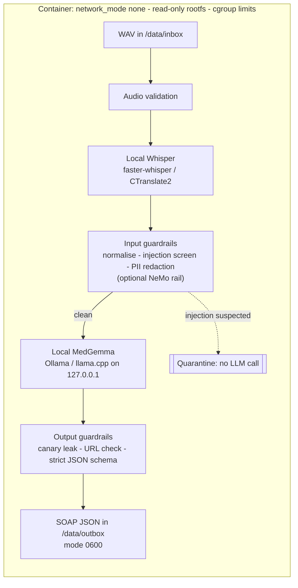

# medgemma-aegis

**Offline-first clinical voice → SOAP-note pipeline with security guardrails and data sovereignty by design.**

Raw doctor–patient audio never leaves the machine. `medgemma-aegis` transcribes locally with
Whisper (CTranslate2), screens the transcript with input guardrails, drafts a structured SOAP
note with a locally hosted Google MedGemma model, validates the output, and writes JSON for a
local EMR to ingest — all inside a container with **no network interface**.

> ⚠️ **Not a medical device and not "HIPAA certified".** This is a reference implementation
> that demonstrates technical safeguards. Running it on real PHI requires your organisation's
> own risk analysis, access control, audit logging, encryption at rest, and clinician review of
> every note. Generated notes are **AI drafts**.

## Why this exists

Sending raw clinical audio to a third-party cloud API creates compliance complications under
HIPAA-style rules (business-associate agreements, data residency, vendor telemetry). The trade-off
this project makes is explicit: **spend local compute to eliminate the third-party data path.**

## Architecture



| Stage | Module | Notes |
|---|---|---|
| Audio validation | `audio.py` | PCM WAV only; duration cap |
| Speech-to-text | `transcribe.py` | `faster-whisper`, `local_files_only=True` |
| Input guardrails | `guardrails.py` | NFKC + zero-width stripping, injection rules, PII redaction |
| Optional NeMo rail | `nemo_rails.py`, `config/guardrails/` | Experimental, off by default |
| LLM | `llm.py` | Ollama HTTP client; **rejects non-loopback hosts**, ignores proxies |
| Output guardrails + schema | `pipeline.py`, `soap.py` | Canary, URL block, `extra="forbid"` Pydantic model, 1 repair retry |
| Egress self-check | `airgap.py` | Refuses to start if a public IP is reachable |
| Result store | `store.py` | Atomic, `0600` writes, no PHI in logs |

### Why one container?
`network_mode: none` removes *all* networking, including container-to-container. So Ollama runs
inside the same container and is reached over loopback (which still exists). Data enters and
leaves only through two bind mounts. There are **no published ports**.

## Quick start

**Prerequisites:** Docker + Compose v2, ~12 GB RAM for the defaults (see sizing), and a
*connected staging machine* to fetch weights once.

```bash
git clone <your-repo-url> medgemma-aegis && cd medgemma-aegis
make setup                        # create data dirs; outbox owned by uid 10001

# 1. STAGING (needs internet, done once): fetch model weights into ./models
pip install huggingface_hub
python scripts/fetch_whisper.py --size small --dest models

#    MedGemma weights are gated: accept the terms on Hugging Face, download a GGUF build,
#    then import it into a local Ollama model store under ./models:
#    (edit the FROM line in models/Modelfile.medgemma first)
OLLAMA_MODELS=./models/ollama ollama create medgemma -f models/Modelfile.medgemma
#    Ensure the container's OLLAMA_MODELS (/models) contains the store, e.g. move
#    models/ollama/* up one level, or change OLLAMA_MODELS in the Dockerfile.

# 2. BUILD (needs internet) and RUN (needs none)
make build && make up

# 3. Drop audio in, get JSON out
cp visit-001.wav data/inbox/
cat data/outbox/visit-001.soap.json
```

Health: `docker compose ps` (healthcheck runs `aegis selfcheck`: egress blocked + model loaded).

### Without Docker (development)
```bash
pip install -e ".[dev,whisper]"
export AEGIS_REQUIRE_AIRGAP=false AEGIS_LLM_MODEL=medgemma   # needs a local `ollama serve`
aegis text examples/sample_transcript.txt                     # guardrails + SOAP, no audio
aegis process path/to/visit.wav
```

## Output

```json
{
  "schema_version": "1.0",
  "status": "ok",
  "source": "visit-001.wav",
  "model": "medgemma",
  "guardrails": { "injection_flags": [], "redactions": {"PHONE": 1}, "quarantined": false, "reason": null },
  "note": { "subjective": "...", "objective": "...", "assessment": "...", "plan": "..." },
  "disclaimer": "AI-generated draft. Must be reviewed and signed off by a licensed clinician.",
  "error": null
}
```
`status` is `ok`, `quarantined` (guardrail tripped; `note` is null; route to a human), or
`failed` (`error` holds a PHI-free code). Full example: [`examples/sample_output.json`](examples/sample_output.json).

## Configuration

| Variable | Default | Purpose |
|---|---|---|
| `AEGIS_LLM_MODEL` | `medgemma` | Ollama model name |
| `AEGIS_LLM_HOST` | `http://127.0.0.1:11434` | Must be loopback or startup fails |
| `AEGIS_WHISPER_MODEL_PATH` | `/models/whisper-small` | Local faster-whisper directory |
| `AEGIS_WHISPER_DEVICE` / `_COMPUTE_TYPE` | `cpu` / `int8` | Use `cuda` / `float16` with a GPU-enabled runtime |
| `AEGIS_INJECTION_POLICY` | `quarantine` | `flag` records detections but still runs the model |
| `AEGIS_REQUIRE_AIRGAP` | `true` | Refuse to start if egress is possible |
| `AEGIS_MAX_AUDIO_SECONDS` | `3600` | Reject longer recordings |
| `AEGIS_USE_NEMO` | `false` | Enable the experimental NeMo input rail |
| `AEGIS_MEM_LIMIT` / `AEGIS_CPUS` | `12g` / `6` | Compose cgroup limits |

## Hardware sizing (starting points, not benchmarks)

| Component | Rough memory | Note |
|---|---|---|
| Whisper `small` (int8, CPU) | ~1–2 GB | `base`/`tiny` are faster but less accurate |
| MedGemma 4B, 4-bit GGUF | ~3–5 GB + context | Larger MedGemma variants need substantially more |
| OS / app / headroom | 2+ GB | |

Measure on your hardware and tune `AEGIS_MEM_LIMIT`/`AEGIS_CPUS`. CPU inference is slower
than real time for long audio; a GPU is recommended for clinic-scale throughput.

## Security controls at a glance

- **No network:** `network_mode: none`, no ports, runtime egress probe, loopback-only LLM client
- **Hardened container:** non-root, read-only rootfs, `cap_drop: ALL`, `no-new-privileges`, PID/CPU/memory limits, no swap
- **Untrusted-input handling:** normalisation, injection heuristics, delimiter escaping, quarantine-before-inference
- **Output validation:** canary leak detection, URL blocking, strict schema, coarse PHI-free errors
- **Data minimisation:** PII redaction pre-inference; no transcript persisted; `0600` outputs
- **Offline by construction:** `local_files_only`, `HF_HUB_OFFLINE`, telemetry flags

Details, assumptions, and residual risk: [`docs/THREAT_MODEL.md`](docs/THREAT_MODEL.md).

## Testing

```bash
pip install -e ".[dev]"
pytest -q          # 25 tests: guardrails, pipeline, schema, loopback/air-gap, audio validation
ruff check . && ruff format --check .
```
Tests use fake LLM/transcriber objects, so they run with no models or network. CI runs them
on every push (`.github/workflows/ci.yml`).

## Known limitations & roadmap

- **File-based, not live streaming.** The pipeline processes completed WAV files. Streaming ASR is future work.
- **No encryption at rest / in transit inside the host.** Use volume encryption; add per-file encryption (e.g. age/AES-GCM) if required.
- **Regex PII redaction misses names, addresses and spoken digits.** Add an NER-based redactor (e.g. Presidio).
- **Injection defence is heuristic** (plus optional, experimental NeMo). Keep a clinician in the loop.
- **No auth or audit trail** — put it behind your own access controls and add tamper-evident audit logging.
- **Docker image not yet build-tested in CI**; pin the Ollama base image digest and Python dependency hashes.
- **Note quality is unevaluated.** Add a clinician-reviewed evaluation set before any real use.

## Project layout

```
src/aegis/        pipeline, guardrails, LLM/ASR clients, CLI
config/guardrails/  optional NeMo Guardrails config (experimental)
docker/, Dockerfile, docker-compose.yml   hardened offline runtime
docs/THREAT_MODEL.md
scripts/fetch_whisper.py, models/Modelfile.medgemma   staging helpers
tests/            25 offline unit tests
```

## Licensing notes

Code: MIT | **Model weights are not covered by this licence:**
MedGemma is distributed under Google's Health AI Developer Foundations terms; Whisper weights
are MIT. Review each model's terms before use.
